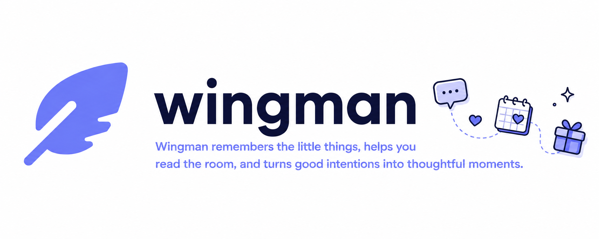

# Wingman

Wingman is a private Telegram relationship assistant for one owner. It helps you remember useful details, understand ongoing conversations, plan thoughtful dates, and review how an AI response was produced.

It is designed to feel like a natural conversation with a thoughtful friend. Memory tools, retrieval, prompts, and diagnostics work behind the scenes. Telegram stays focused on the conversation, while the local dashboard gives you control and transparency.

## What it helps with

- Remember durable preferences, observations, interests, and relationship details
- Keep memory notes with supporting context and source messages
- Retrieve relevant memories using lexical and semantic matching
- Keep recent conversation history and rolling summaries
- Suggest uncertain memories before saving them
- Plan places, ideas, events, and one-time reminders
- Search and save planning records conversationally when the owner clearly asks
- Send due reminders through Telegram
- Use the owner's name, primary person's name, timezone, and current time naturally
- Keep facts, observations, and inferences separate
- Accept Telegram voice messages, transcribe them, and process them like text
- Accept Telegram images with captions or without captions, including small image groups
- Send image content to the vision-capable model while keeping image bytes temporary
- Preserve original quality when an image is sent as a Telegram file instead of a compressed photo
- Accept PDF, DOCX, TXT, Markdown, CSV, and JSON files for temporary analysis
- Keep temporary attachment metadata for traceability while deleting local input files after processing
- Inspect prompts, dynamic context, tool calls, retrieval scores, token use, latency, and errors

## Telegram experience

Wingman is built to keep ordinary conversation ordinary. It does not save every greeting, suggestion, or temporary plan. It proposes uncertain personal observations before saving them and shows saved memories as visible Telegram cards with owner controls.

The assistant can use saved context naturally, for example by connecting a known preference to a gift idea. It does not mention database IDs, retrieval scores, internal tools, or prompt mechanics in normal replies.

## Local dashboard

The dashboard runs on the same machine as the bot and is available at `http://127.0.0.1:8080/` by default. Wingman tries nearby ports when the default port is busy and opens the selected dashboard when possible.

Dashboard pages include

- Dashboard overview with counts and quick links
- Health checks for the database, Telegram, and OpenAI configuration
- Memories with create, edit, delete, restore, confirm, and note controls
- Context editor for owner-editable static conversation guidance
- A high-level explanation of how dynamic context is assembled
- Conversations with summaries and recent messages
- Planning for places, saved ideas, events, and reminders
- Retrieval inspection with query details, memory text, score components, notes, and source IDs
- Full API request and response inspection with highlighted, scrollable JSON and copy buttons
- Settings for local runtime values, models, identity, timezone, and credentials
- System controls for pause or resume, backups, JSON export, JSON import, and safe updates

## Privacy and safety

Wingman is local-first and intended for one trusted owner. The web dashboard binds to `127.0.0.1` and has no password because it is not intended to be exposed publicly. Telegram access uses a numeric owner ID.

The SQLite database, conversation history, memories, logs, API snapshots, and backups can contain private relationship information. Keep the project directory and data directory private. API keys and Telegram tokens are stored in the local plaintext `.env` file when configured through the dashboard. They are masked in the dashboard and must never be committed to Git.

The application controls authorization, memory ownership, tool schemas, safety rules, and confirmation behavior in code. The editable prompt changes conversation style only. It cannot override those application rules.

OpenAI receives the conversation content required to generate replies and embeddings according to the configured API use. Do not use Wingman for medical, legal, financial, or other high-stakes decisions.

## Requirements

- Python 3.12 or newer
- A Telegram bot token from BotFather
- The numeric Telegram user ID of the owner
- An OpenAI API key

## Install

```bash
git clone https://github.com/HalflingWizard/wingman.git
cd wingman
./scripts/install.sh
source .venv/bin/activate
cp .env.example .env
```

Edit `.env` with the Telegram and OpenAI values, then check the installation

```bash
wingman doctor
wingman start
```

The dashboard opens at the selected local address. Use `wingman start --no-browser` to keep it from opening a browser.

## Configuration

The main configuration values are in `.env`

```dotenv
WINGMAN_TELEGRAM_BOT_TOKEN=
WINGMAN_TELEGRAM_OWNER_ID=
WINGMAN_OPENAI_API_KEY=
WINGMAN_OPENAI_MAIN_MODEL=gpt-5-nano
WINGMAN_OPENAI_SUMMARY_MODEL=gpt-5-nano
WINGMAN_OPENAI_EMBEDDING_MODEL=text-embedding-3-small
WINGMAN_OPENAI_TRANSCRIPTION_MODEL=gpt-4o-mini-transcribe
WINGMAN_VOICE_MAX_BYTES=25000000
WINGMAN_MAX_ATTACHMENTS=5
WINGMAN_ATTACHMENT_RETENTION_SECONDS=600
WINGMAN_USER_NAME=
WINGMAN_PRIMARY_PERSON_NAME=
WINGMAN_TIMEZONE=UTC
WINGMAN_PROMPT_FILE=prompts/wingman.md
```

The Context page edits the prompt file without changing protected application rules. The Settings page can update selected values while keeping secret values masked. Restart the application after changing Telegram credentials if the running polling process does not pick up the change.

## Commands

```bash
wingman start
wingman start --no-browser
wingman stop
wingman restart
wingman status
wingman update
wingman doctor
```

`wingman update` performs a safe fast-forward update only when the Git worktree is clean. The System page provides the same update action, together with database backups, export, import, and bot pause or resume.

## Data and backups

The default database is `wingman.db` in the current directory. Set `WINGMAN_DATABASE_URL` to use another SQLite location. The System page can export user data as versioned JSON and import that JSON later. Database backups are stored under `WINGMAN_DATA_DIR/backups` with restrictive file permissions.

## Development

Run the checks from the project root

```bash
.venv/bin/ruff check .
.venv/bin/ruff format --check .
.venv/bin/mypy wingman
.venv/bin/pytest
```

The project is a small Python monolith using FastAPI, aiogram, SQLAlchemy, SQLite, and the OpenAI Responses API. It keeps the dashboard server-rendered and avoids a separate frontend build system.

## Documentation

- [Build specification](BUILD_SPEC.md)
- [Architecture](ARCHITECTURE.md)
- [Security notes](SECURITY.md)
- [Implementation history](IMPLEMENTATION_PLAN.md)
- [Version 3.0.0 release notes](RELEASE_NOTES_v3.0.0.md)

## License

This repository does not currently declare an open-source license. Add a license before distributing it as an open-source project.
